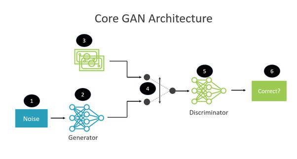
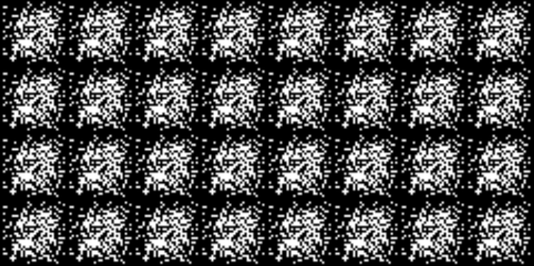
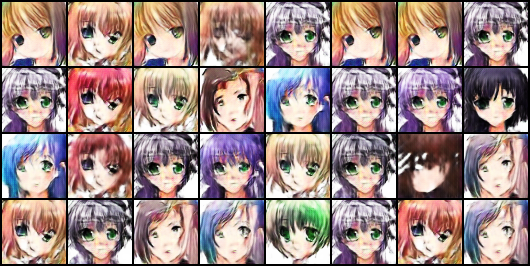

# GAN Models Comparison

## Introduction

Generative Adversarial Networks (GANs) revolutionized artificial intelligence by introducing a game-like framework where a generator and discriminator compete. This repository explores various GAN models, each addressing specific challenges and offering unique capabilities.

## Simple FC GAN

**Description:**  
The Simple Fully Connected Generative Adversarial Network (Simple FC GAN) is an elementary GAN architecture that employs fully connected layers. It is favored for its simplicity, making it an excellent choice for those new to GANs and projects with small datasets. However, its capacity for handling complex data is limited, and it can be susceptible to mode collapse, where the generator produces a limited variety of outputs. Additionally, due to the absence of convolutional layers, it may struggle to capture spatial information effectively.

**Advantages:**
1. Easy to implement.
2. Fast training time.
3. Suitable for small datasets.

**Disadvantages:**
1. Limited capacity for complex data.
2. Prone to mode collapse.
3. Lack of spatial information capture.

## DCGAN

**Description:**  
The Deep Convolutional Generative Adversarial Network (DCGAN) is an extension of the GAN architecture that incorporates convolutional layers. DCGAN is known for its stable training process and ability to capture spatial hierarchies effectively, leading to improved image quality. While it is a powerful model, it may suffer from mode collapse, especially when not provided with sufficiently large datasets. Training DCGAN models also tends to require a longer time compared to simpler GAN architectures.

**Advantages:**
1. Stable training process.
2. Captures spatial hierarchies well.
3. Improved image quality.

**Disadvantages:**
1. May suffer from mode collapse.
2. Requires larger datasets for effectiveness.
3. Longer training time.

## WGAN

**Description:**  
The Wasserstein Generative Adversarial Network (WGAN) introduces improvements to the training stability of GANs. It addresses issues such as mode collapse more effectively and employs the Wasserstein distance metric for measuring the difference between generated and real distributions. While WGAN offers enhanced stability, it may face challenges like the vanishing gradient problem and demands a more complex implementation compared to traditional GANs. Achieving optimal performance also requires careful tuning of hyperparameters.

**Advantages:**
1. Improved training stability.
2. Handles mode collapse better.
3. Utilizes Wasserstein distance.

**Disadvantages:**
1. May encounter vanishing gradient problem.
2. More complex to implement than GANs.
3. Requires careful hyperparameter tuning.

## WGAN-GP

**Description:**  
The Wasserstein Generative Adversarial Network with Gradient Penalty (WGAN-GP) further refines the WGAN model by incorporating a gradient penalty to address certain challenges. It excels in stabilizing training, mitigating mode collapse, and providing better convergence. However, this improvement comes at the cost of increased computational complexity due to the gradient penalty. WGAN-GP demands meticulous hyperparameter tuning and may exhibit slightly slower training compared to WGAN.

**Advantages:**
1. Addresses gradient issues in WGAN.
2. Improved stability over WGAN.
3. Handles mode collapse better.

**Disadvantages:**
1. Computational cost due to gradient penalty.
2. Still requires careful hyperparameter tuning.
3. Slightly slower training compared to WGAN.

## Conditional GAN (cGAN)

**Description:**  
Conditional GANs (cGANs) extend traditional GANs by incorporating additional information, such as class labels, into the training process. This allows for the generation of specific output based on given conditions. cGANs have applications in image-to-image translation, style transfer, and other tasks where the output needs to be controlled or conditioned on specific input features.

**Advantages:**
1. Enables conditional image generation.
2. Useful for tasks requiring controlled outputs.
3. Enhanced flexibility in generating diverse outputs.

**Disadvantages:**
1. Increased complexity in implementation.
2. Requires labeled datasets for conditional training.
3. May face challenges with mode collapse in certain conditions.

